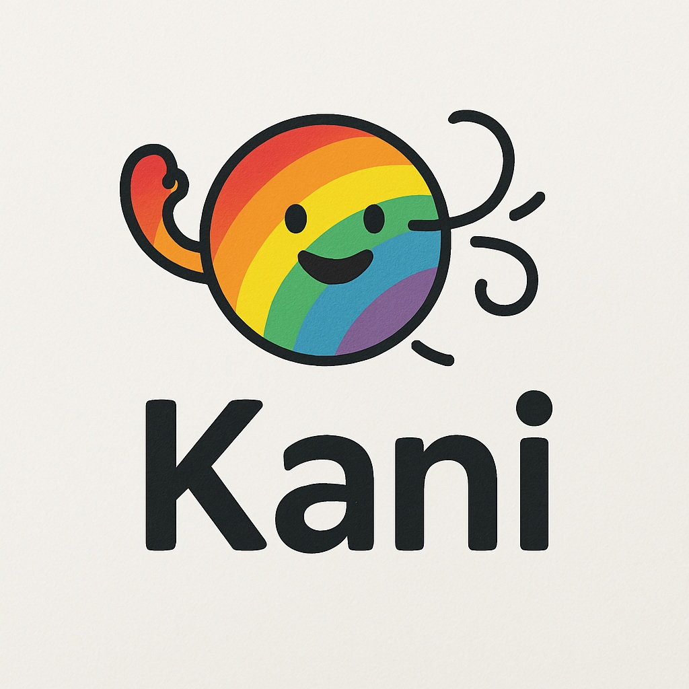

<div align="center">
    
    <h1>Kani Chatbot for Hawaiʻi’s Resilience</h1>
</div>
  
*Solution for Challenge 2 in Aloha Data:🌈🏝️AI Hackathon for Hawaiʻi’s Resilience*  

<a href="https://datascience.hawaii.edu/ai-hackathon/" target="_blank">Hackathon Details</a>

---

## Overview

Kani Chatbot is an interactive messenger-style chatbot solution developed as a submission for Challenge 2 in the Aloha Data AI Hackathon. This project leverages modern web technologies to create a responsive chat interface that supports both text and voice inputs. The chatbot utilizes a backend service to process user messages and generate responses—ensuring an engaging and accessible user experience.


---

## Features

- A clean, modern chat UI with Responsive Design.
- Built-in voice input for converting speech to text and voice reply functionality for inclusive experience.
- HCDP navigation made Easier than ever
- Easily access, process, learn, plot climate data
- LLM-powered chat
- Fully modular functionality
- Your data privacy is secured

---

## Handled Security concerns:

* Prompt Injection Attacks:
>Malicious users can craft inputs that manipulate the model’s behavior. By embedding hidden instructions, attackers might force the LLM to produce unintended or harmful outputs.

>In our case, we don't answer anything that does not fall under either of two criteria - even when one criteria is selected, the response is driven by selective data. So injection is not possible


* Data Leakage:
>Since LLMs are trained on vast datasets, there's a risk they might inadvertently reveal sensitive or private information that was part of their training data, especially if prompted in specific ways.

>In our case, our answers are strictly restricted by the tools that retrieve public data. So it is not possible to get personal info from our chat.


* Adversarial Attacks:
>Attackers can design inputs to trick the model into making errors or generating inappropriate content. These subtle, crafted inputs can lead the model to produce outputs that deviate significantly from the intended response. 

>In our case, If the query can't be answered from the extracted dtaa, we refuse to answer at all preventing itself from adversarial attacks


---

## Project Structure
```plaintext
.
├── notebooks
│   ├── this_is_for_makani.ipynb
│   ├── updated_code.ipynb
│   ├── output_files
│   └── ndvis.html
├── static
│   ├── Kani.jpg
│   ├── microphone.png
│   ├── rain.gif
│   ├── script.js
│   └── style.css
├── template
│   └── Kani 15.html
├── app.py
├── llm.py
├── README.md
├── requirements.txt
└── tokens.json
```

> **Note:** Ensure that the static assets (CSS, JS, images) are placed correctly so that the backend can serve them.

## Structure of tokens.json
```json
{
    "hcdp_api_token": "YOUR API TOKEN",
    "gmaps_api_key": "YOUR GOOGLE MAPS API KEY",
    "api_base_url": "https://api.hcdp.ikewai.org",
    "gemini_api_key": "YOUR GEMINI API KEY"
}
```

---

## Setup & Installation

1. Clone the Repository:
```bash
git clone https://github.com/WillHarrigan/hawaii_ai_hackathon.git
cd hawaii_ai_hackathon
```

2. Set Up the Environment (Optional):
```bash
python -m venv venv
source venv/bin/activate
```
> **Note:** On Windows: venv\Scripts\activate

3. Install Dependencies:
```bash
pip install -r requirements.txt
```

4. Run the Application:
```bash
uvicorn app:app \
  --host 127.0.0.1 \
  --port 8000 \
  --ssl-certfile=./localhost.pem \
  --ssl-keyfile=./localhost-key.pem \
  --reload
```
> **Note:** localhost.pem and localhost-key.pem are certificates to make your website secured. Without a secured websiite, the browser may prevent you from using the voice features. 

5. [Optional] How to get .pem files?
* macOS
```bash
brew install mkcert

# if you use Firefox
brew install nss 
```

* Windows
```bash
choco install mkcert
```

* Set Up the Local CA
```bash
mkcert -install
```

* Generate Certificates for localhost
```bash
mkcert localhost
```

---
## User Needs and Economic Impact Report

### Problem Statement

Despite the abundance of publicly available climate data for Hawaiʻi, residents, students, researchers, and decision-makers struggle to access and interpret it effectively.

#### Current Platforms Are Often:
- Overly technical or fragmented
- Difficult to navigate for non-experts
- Lacking intuitive visualizations or summaries
- Not designed for conversational access or personalized insights

As climate risks intensify — including rising sea levels, heatwaves, and shifting rainfall patterns — there is an urgent need to make climate information more accessible, trustworthy, and actionable for the broader public.

#### Economic Cost of the Problem

- **Sea level rise alone** threatens over **$19 billion** in property value statewide (UH News, 2018).
- Poor access to data hinders climate adaptation, increasing future costs of recovery and health impacts.
- Delayed action reduces effectiveness of investments in resilience.
- Researchers and students lose hundreds of hours navigating complex portals.

**Even a 1% improvement** in climate decision-making could save **tens of millions** across sectors.

#### Estimated Cost of the Problem (Annual)

| Problem Area               | Users / Basis                          | Cost         |
| -------------------------- | -------------------------------------- | ------------ |
| Wasted Productivity        | 2,000 users × 10 hours × $40/hr         | $800,000     |
| Poor Adaptation / Planning | 0.5% of $19B potential damages          | $95,000,000  |
| Inefficient Use of Funds   | 1.5% of $100M annual budget             | $1,500,000   |
| Lost Educational Value     | 5,000 students × $50/student            | $250,000     |
| **Total Annual Cost**      |                                        | **$97.55 million** |

---

## Survey

To ensure our solution meets real needs, we conducted a targeted user survey with 22 potential users across Hawaiʻi — including residents, students, researchers, educators, and policy influencers. You can find our survey questions at:  

<a href="https://docs.google.com/forms/d/e/1FAIpQLSclJClgc3AUjlcIWB2BaTx89NYxv8ABRIb4YwqJmZbt4FLwqA/viewform" target="_blank">Survey Link</a>


#### Key Findings:
- Currently, most people look for climate data by using data portals or Google Search and they have the following common challenges:
  - Too much technical jargon
  - Difficulty finding the right dataset
  - Hard-to-navigate websites
- Users expressed a strong need for:
  - Data and answers based on trusted sources
  - Time series visualizations and downloadable data
  - Natural, easy-to-use conversational interface
- **89%** of respondents said they are likely or very likely to use an AI chatbot to explore Hawaiʻi climate data.

Our potential users want a smarter, simpler, and more human way to engage with Hawaiʻi’s climate data. Our solution does not only solve a validated problem but also co-creates value with the people we want to serve.

---

## Our Solution

We are building an **AI-powered chatbot** designed to act as a **Climate Concierge** for Hawaiʻi. Our target audience are residents, students, researchers, educators, and policy-influencers across Hawaii. Our chatbot enables users to:

- Easily ask questions about climate conditions, risks, and trends across the Hawaiian Islands
- Receive trustworthy responses backed by data from the Hawaiʻi Climate Data Portal
- Visualize trends in temperature, rainfall, and sea level rise with charts
- Get personalized insights and explanations based on their needs and level of expertise

#### Unique Value of Our Solution

Unlike generic AI tools, our **Kani climate data concierge** chatbot:
- Offers local relevance, verified data, and user-centered insights
- Is trained on local datasets like the Hawaiʻi Climate Data Portal (HCDP)
- Supports policy responses, student learning, and community decision-making

---

## Economic Impact of Our Solution

Our solution provides measurable economic value across four key areas:
- **Productivity gains:** Saves 10 hours per user for researchers and students
- **Climate risk reduction:** Enables early action and reduces 0.1% damages
- **Smarter public planning:** Helps prioritize investments using trusted data
- **Education:** Improves climate literacy and data skills

#### Estimated Economic Impact (Annually)

| Impact Area              | Details                                   | Estimated Value    |
| ------------------------ | ----------------------------------------- | ------------------ |
| Productivity Gains       | 2,000 users × 10 hours × $40/hr            | $800,000           |
| Climate Risk Reduction   | 0.1% of $19B potential damage avoided      | $19,000,000        |
| Smarter Policy & Planning| 1% of $50M influenced spending             | $500,000           |
| Education & Literacy     | 5,000 students × $50/student               | $250,000           |
| **Total Annual Positive Impact**  |                                           | **$20.55 million** |

---

## Sustainability of Our Solution

Our chatbot is built for long-term sustainability in both technical and financial aspects.

### Technical Sustainability
- **Continuous learning:** Integrates real-time updates from trusted sources like HCDP
- **Modular architecture:** Scalable to new regions, platforms, and technologies

### Financial Sustainability
- **Institutional partnerships:** With UH, government, and research institutions
- **Educational licensing:** Premium tools for schools and universities
- **Grant and government support:** Aligns with climate resilience and public education goals
- **Open-source core with paid services:** Consulting, analytics, and custom deployments

This model ensures that our solution continues to provide value and evolve with Hawaiʻi’s needs.
